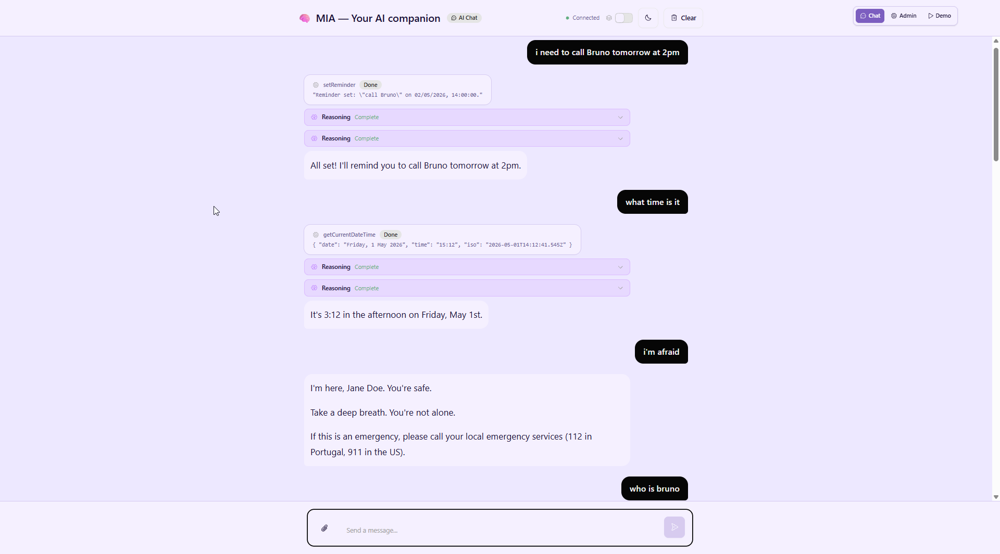
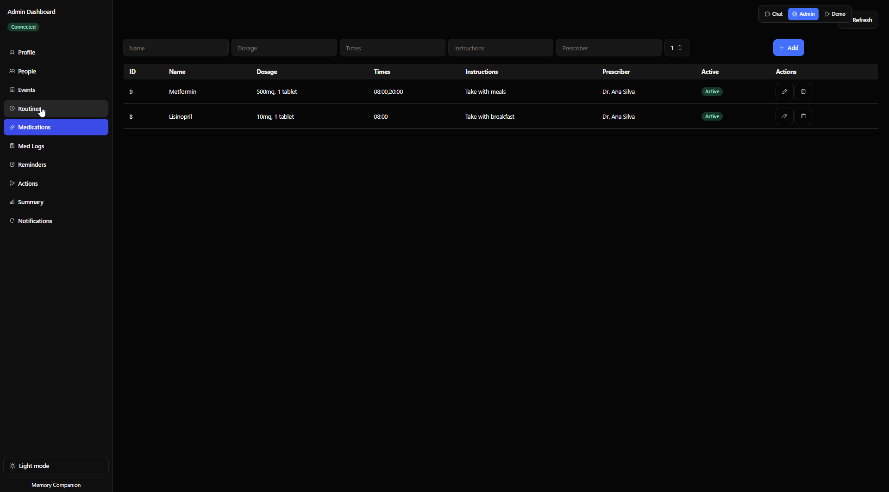

# Memory Companion

An AI companion for people with early memory decline, built on Cloudflare Agents.
Mia remembers people, events, and medications — and never invents facts she wasn't told.

## What it does

Memory Companion bridges the gap between patients experiencing early memory loss and the caregivers who support them. It combines a conversational AI companion for the patient with a full admin dashboard for caregivers.

**For the patient**, Mia provides a simple chat interface where they can ask about their day, receive medication reminders, set routines, and talk through moments of confusion. Every answer is grounded in facts stored in SQLite — if Mia doesn't know something, she says so rather than guessing.



**For the caregiver**, the admin dashboard offers complete visibility and control over the patient's data: profile, people, events, routines, medications, and medication adherence logs.



## Quick links

| Resource | Link |
|----------|------|
| **Slide deck** (HTML) | [`mia-pitch-deck.html`](./mia-pitch-deck.html) |
| **Slide deck** (PDF) | [`mia-pitch-deck.pdf`](./mia-pitch-deck.pdf) |
| **Demo** | [`/demo`](http://localhost:5173/demo) — run `npm run dev` and open |
| **Admin dashboard** | [`/admin`](http://localhost:5173/admin) — full CRUD on all SQLite tables |

## Architecture

Memory Companion is built on **Cloudflare Agents** — Durable Objects with SQLite storage that run AI inference at the edge. The stack:

- **Cloudflare Workers + Durable Objects** — one `CompanionAgent` per user with persistent SQLite state
- **Kimi via Anthropic Messages API** — the AI SDK streams responses through the Anthropic adapter (`@ai-sdk/anthropic`) using `claude-sonnet-4-20250514`
- **Workers AI** — fallback model provider for parallel memory extraction (`@cf/meta/llama-3.3-70b-instruct-fp8-fast`)
- **Vite + React** — client-side UI with `useAgentChat` for real-time WebSocket chat
- **Scheduled tasks** — idempotent cron registrations for morning briefings, evening check-ins, and medication reminders with 45-minute follow-ups

## Quickstart

**Prerequisites:** Node 20+, npm

```bash
git clone <repo>
cd agents-day/memory-companion
npm install
npm run dev
```

Open **http://localhost:5173** and start chatting.

### First time

Mia will walk you through a short onboarding (name → city → timezone → one person → one medication).
To skip onboarding and jump straight to the demo experience:

```bash
curl -X POST http://localhost:5173/agents/companion-agent/default/seed
```

This loads a pre-built profile (António in Lisbon, daughter Maria, one medication) so you can try every feature immediately.

### Key things to try

| What to say / do | What happens |
|---|---|
| "What's today?" | Grounding card — date, city, meds, routines, recent events |
| "Tell me about Maria" | Mia retrieves Maria from memory (or says she doesn't know yet) |
| "I took my aspirin" | Extraction pass silently logs the medication event |
| Medication reminder card → ✅ | Logs the dose as taken |
| Morning briefing card (08:00) | Daily summary with mood buttons |
| **Admin dashboard** | Click the **Admin** button in the top-right to view and edit all SQLite data (profile, people, events, routines, medications, med logs) |

### Trigger a briefing immediately (don't wait for 08:00)

```bash
curl -X POST http://localhost:5173/agents/companion-agent/default/briefing
```

## How it works

- **No hallucination by design.** The system prompt contains only today's date, your name, and your city. Every other fact is retrieved from SQLite on demand. If a fact isn't there, Mia says so.
- **Parallel memory extraction.** Every message you send triggers two Workers AI calls concurrently: one for the reply, one silent pass that writes anything new you mentioned into the database.
- **Distress detection bypasses AI.** Phrases like "I can't go on" trigger a hardcoded safety response with emergency contacts before any model call happens.

## Commands

All commands run from `memory-companion/`:

```bash
npm run dev          # Vite dev server + Worker on http://localhost:5173
npm test             # vitest run
npm run check        # format + lint + tsc (run before committing)
npm run deploy       # build and deploy to Cloudflare
```

## Further reading

- `memory-companion/USAGE.md` — full operator and user manual
- `docs/superpowers/specs/2026-05-01-memory-companion-design.md` — architecture and design rationale
- `docs/superpowers/plans/2026-05-01-memory-companion.md` — implementation plan
